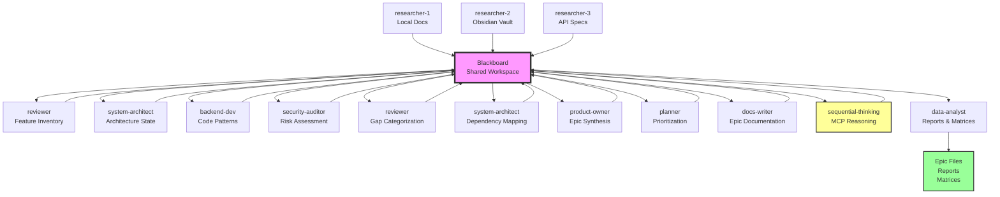
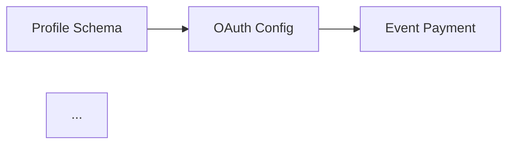

# /identify-gaps-and-generate-epics

**Scan documentation sources, analyze codebase implementation, identify gaps, and generate actionable epics with deep reasoning.**

---

## Purpose

This command orchestrates a comprehensive gap analysis workflow that:

1. **Discovers Requirements** - Scans local documentation and Obsidian vault for requirements, specifications, and architectural decisions
2. **Analyzes Implementation** - Inventories existing codebase features, patterns, and capabilities
3. **Identifies Gaps** - Compares documented requirements against actual implementation to find missing features, incomplete implementations, and architectural drift
4. **Generates Epics** - Uses sequential-thinking MCP to create detailed, prioritized epics with dependencies, user stories, and implementation strategies
5. **Produces Deliverables** - Outputs gap analysis reports, priority matrices, and epic specifications ready for backlog integration

**Best for:** Organizations scaling development across multiple teams, ensuring alignment between requirements and implementation, and establishing sustainable backlog management practices.

---

## Multi-Agent Coordination Strategy

This command uses the **Blackboard Pattern** for multi-agent coordination, where specialized agents contribute to a shared workspace:



**Coordination Pattern:**
- **Blackboard (BB)**: Central knowledge repository containing normalized requirements, implementation inventory, gap list, and epic specifications
- **Agents**: Specialized workers read from and write to blackboard
- **Control Flow**: Sequential phases with parallel agent execution within phases
- **Context Preservation**: All intermediate artifacts stored in blackboard for cross-phase access

---

## Execution Flow

### Phase 1: Documentation Discovery (0-15 mins)

**Agents:** `researcher` (3 instances in parallel)

**Tasks:**
1. **Local Documentation Scanning** (`researcher-1`)
   - Scan `.claude/` directory for commands, docs, architecture files
   - Read project documentation: `README.md`, `CONTRIBUTING.md`, `SETUP_INSTRUCTIONS.md`, `QUALITY_GATES_SETUP.md`, `TEST_REPORT.md`
   - Parse registry indexes: `agents.index.json`, `skills.index.json`, `mcps.index.json`, `workflows.index.json`
   - Extract TypeScript type definitions for API contracts

2. **Obsidian Vault Querying** (`researcher-2`)
   - Use `mcp__obsidian__list_files_in_vault` to discover documentation structure
   - Query `System/Claude-Instructions/` for orchestration requirements
   - Scan `Repositories/markus41/Alpha-1.4/` for project-specific documentation
   - Search `Projects/` for cross-project requirements
   - Use `mcp__obsidian__simple_search` and `mcp__obsidian__complex_search` for keyword-based discovery
   - **Fallback:** If Obsidian MCP unavailable, skip vault scanning and proceed with local docs only

3. **API Specification Parsing** (`researcher-3`)
   - Check for OpenAPI/Swagger specifications
   - Analyze database schema files (`.sql`, migration files)
   - Review TypeScript interface definitions for API contracts
   - Document external integration requirements (Supabase, Vercel, GitHub, etc.)

**Tools:** `Read`, `Glob`, `Grep`, `mcp__obsidian__*`, `mcp__github__get_file_contents`

**Output to Blackboard:**
```json
{
  "requirements": [
    {
      "id": "req-001",
      "source": "README.md:42",
      "category": "feature",
      "description": "User authentication with OAuth2",
      "priority": "high",
      "acceptance_criteria": ["..."]
    }
  ]
}
```

---

### Phase 2: Codebase Analysis (15-35 mins)

**Agents:** `reviewer`, `system-architect`, `backend-dev`

**Tasks:**
1. **Feature Inventory** (`reviewer`)
   - Scan implementation directories for feature modules
   - Identify API endpoints, routes, and handlers
   - Map UI components to feature requirements
   - Catalog test coverage for existing features

2. **Code Structure Mapping** (`backend-dev`)
   - Analyze project structure and module organization
   - Identify design patterns in use (e.g., repository pattern, factory pattern)
   - Document code quality metrics (complexity, duplication)
   - Map database models to schema definitions

3. **Architecture State Analysis** (`system-architect`)
   - Review architecture decisions and current state
   - Identify technical debt and architectural drift
   - Document integration points with external services
   - Analyze scalability and performance characteristics

**Tools:** `Grep`, `Read`, `mcp__github__search_code`, `Glob`

**Output to Blackboard:**
```json
{
  "implementation": [
    {
      "id": "impl-001",
      "feature": "OAuth2 authentication",
      "status": "partial",
      "completion": 60,
      "files": ["app/(auth)/login/page.tsx", "lib/auth.ts"],
      "patterns": ["next-auth", "jwt"],
      "tests": ["__tests__/auth.test.ts"],
      "coverage": 75
    }
  ]
}
```

---

### Phase 3: Gap Detection (35-60 mins)

**Agents:** `reviewer`, `security-auditor`, `system-architect`

**Tasks:**
1. **Requirements vs Implementation Comparison** (`reviewer`)
   - Match requirements to implementations
   - Identify completely missing features
   - Flag partial implementations with completion estimates
   - Document feature drift (implementation diverges from spec)

2. **Gap Categorization** (`security-auditor`)
   - Categorize gaps by type: missing, incomplete, divergent, deprecated
   - Assess security implications of gaps
   - Identify compliance risks
   - Estimate complexity and risk for each gap

3. **Dependency Mapping** (`system-architect`)
   - Build dependency graph between gaps
   - Identify blocking relationships
   - Determine implementation sequence constraints
   - Calculate critical path for gap resolution

**Tools:** Custom comparison logic, dependency graph generation

**Output to Blackboard:**
```json
{
  "gaps": [
    {
      "id": "gap-001",
      "requirement_id": "req-001",
      "implementation_id": "impl-001",
      "type": "incomplete",
      "description": "OAuth2 provider configuration incomplete",
      "severity": "high",
      "complexity": "medium",
      "dependencies": ["gap-003"],
      "estimated_effort": "3-5 days",
      "risks": ["Security vulnerability if deployed incomplete"]
    }
  ],
  "dependency_graph": {
    "nodes": ["gap-001", "gap-002", "gap-003"],
    "edges": [{"from": "gap-003", "to": "gap-001"}]
  }
}
```

---

### Phase 4: Epic Generation (60-90 mins)

**Agents:** `product-owner`, `planner`, `docs-writer`, `mcp__MCP_DOCKER__sequentialthinking`

**Tasks:**
1. **Epic Boundary Analysis** (`planner`)
   - Cluster related gaps into epic candidates
   - Determine appropriate scope for each epic
   - Consider team capacity and sprint velocity
   - Balance epic size for manageable delivery

2. **Sequential Thinking Reasoning** (`sequential-thinking MCP`)
   - For each epic cluster, initiate deep reasoning session
   - Thought process for epic synthesis:
     * Analyze gap cluster coherence
     * Determine optimal epic boundaries
     * Reason through dependency resolution strategy
     * Evaluate implementation approaches
     * Consider rollout and migration strategies
     * Assess user impact and change management
     * Generate acceptance criteria
   - Default: 20 thoughts per epic (adaptive 5-30 based on complexity)
   - Output full thinking trace for transparency

3. **Epic Specification** (`product-owner`)
   - Write epic title and description
   - Generate user stories from gaps
   - Define acceptance criteria
   - Estimate story points and effort
   - Assign priority based on business value and dependencies

4. **Epic Documentation** (`docs-writer`)
   - Format epic in standard template
   - Include sequential-thinking reasoning trace
   - Add dependency visualization
   - Document implementation strategy
   - Include rollout and testing plan

**Tools:** `mcp__MCP_DOCKER__sequentialthinking`, `Write`, Markdown formatting

**Output to Blackboard & Files:**
```markdown
# Epic: OAuth2 Authentication System

## Epic ID: epic-001

## Summary
Complete OAuth2 authentication implementation to enable secure third-party login...

## Business Value
Streamlines user onboarding by 40%, improves security posture...

## User Stories

### US-001: Google OAuth Login
**As a** new user
**I want to** log in with my Google account
**So that** I can quickly access the platform without creating new credentials

**Acceptance Criteria:**
- [ ] Google OAuth provider configured in NextAuth
- [ ] Login button redirects to Google consent screen
- [ ] User profile data synced to database
- [ ] Session persisted securely

**Effort:** 3 story points

### US-002: GitHub OAuth Login
...

## Dependencies
- **Requires:** epic-003 (User Profile Schema)
- **Blocks:** epic-005 (Personalized Dashboard)

## Implementation Strategy

### Phase 1: Provider Configuration (2 days)
1. Configure NextAuth with Google and GitHub providers
2. Set up OAuth app credentials in respective platforms
3. Implement callback URL handling

### Phase 2: User Profile Integration (2 days)
...

## Risks & Mitigations
- **Risk:** OAuth token expiration handling
- **Mitigation:** Implement refresh token rotation strategy

## Testing Plan
- Unit tests for auth configuration
- Integration tests for OAuth flow
- E2E tests for login journey
- Security audit for token handling

## Sequential Thinking Reasoning Trace

**Thought 1/20:** Analyzing gap cluster for OAuth authentication. Gaps include: incomplete Google provider (gap-001), missing GitHub provider (gap-002), and incomplete session management (gap-003). These gaps are closely related and should be addressed in a single epic.

**Thought 2/20:** Determining epic boundary. All three gaps relate to OAuth authentication and share dependencies on user profile schema. Keeping them together ensures cohesive delivery.

**Thought 3/20:** Evaluating implementation approaches. Option A: Implement all providers simultaneously. Option B: Implement Google first, then GitHub. Option B reduces risk and allows iterative validation.

...

**Thought 20/20:** Epic specification complete. This epic delivers measurable value by streamlining authentication workflows, improves data visibility through centralized user management, and establishes sustainable security practices for future OAuth integrations.

---

**Epic Metadata:**
- **Priority:** P0 (Critical)
- **Effort:** 13 story points
- **Estimated Duration:** 1 sprint (2 weeks)
- **Assigned Team:** Backend Development
- **Target Release:** v2.1.0
```

---

### Phase 5: Output Generation (90-105 mins)

**Agents:** `docs-writer`, `data-analyst`

**Tasks:**
1. **Write Epic Files** (`docs-writer`)
   - Create `.claude/epics/generated/epic-{id}-{slug}.md` for each epic
   - Include full sequential-thinking trace
   - Format with consistent structure
   - Add cross-references between epics

2. **Generate Gap Analysis Report** (`data-analyst`)
   - Summarize gap discovery results
   - Include gap categorization breakdown
   - Show dependency graph visualization
   - Provide actionable recommendations

3. **Create Priority Matrix** (`data-analyst`)
   - Plot epics on effort vs. value matrix
   - Highlight critical path items
   - Identify quick wins
   - Show risk distribution

4. **Write Summary Dashboard** (`docs-writer`)
   - Create executive summary
   - Show key metrics (total gaps, epic count, estimated effort)
   - Provide next steps and recommendations
   - Link to detailed reports and epic files

**Tools:** `Write`, Markdown formatting, Mermaid diagrams

**Output Files:**
- `.claude/epics/gap-analysis-report.md` - Detailed gap analysis
- `.claude/epics/priority-matrix.md` - Effort vs. value visualization
- `.claude/epics/gaps-summary.md` - Executive summary
- `.claude/epics/generated/epic-{id}-{slug}.md` - Individual epic specifications

---

## Agent Coordination Layers

### Layer 1: Blackboard State Management
- **Responsibility:** Maintain shared knowledge repository
- **Data Structure:** JSON schema for requirements, implementations, gaps, epics
- **Persistence:** Store blackboard state in `.claude/orchestration/db/blackboard-{session-id}.json`
- **Access Pattern:** Read-before-write with optimistic locking

### Layer 2: Phase Coordination
- **Responsibility:** Ensure sequential phase execution with parallel agent operations
- **Mechanism:** Phase completion gates - next phase starts only when all agents in current phase finish
- **Checkpointing:** Save blackboard state between phases
- **Rollback:** Restore from checkpoint if phase fails

### Layer 3: Agent Communication
- **Responsibility:** Enable agents to signal intentions and discoveries
- **Messaging:** Use `.claude/orchestration/messaging/` for inter-agent communication
- **Patterns:**
  - **Broadcast:** Agent announces major discovery to all peers
  - **Request-Response:** Agent requests specific analysis from specialist
  - **Notification:** Agent signals completion or blocker

### Layer 4: Resource Locking
- **Responsibility:** Prevent concurrent modification conflicts
- **Locks:** Acquire locks for shared resources (files, blackboard sections)
- **Timeout:** 5-minute lock timeout with automatic release
- **Deadlock Prevention:** Hierarchical lock acquisition order

### Layer 5: Progress Tracking
- **Responsibility:** Provide visibility into workflow execution
- **Logging:** Record agent activities in `.claude/orchestration/logs/gap-analysis-{timestamp}.log`
- **Metrics:** Track phase duration, agent utilization, gap count, epic count
- **Status Dashboard:** Real-time progress updates via `.claude/orchestration/cli.sh status`

---

## Usage Examples

### Example 1: Initial Gap Analysis for New Project

**Scenario:** Team wants comprehensive gap analysis for newly inherited Alpha-1.4 project

**Command:**
```bash
/identify-gaps-and-generate-epics
```

**Result:**
- Scans all local documentation and Obsidian vault
- Identifies 45 gaps across 8 feature areas
- Generates 12 epics with full reasoning traces
- Outputs priority matrix showing 3 P0 epics, 5 P1 epics, 4 P2 epics
- Estimated total effort: 89 story points (7-9 sprints)

---

### Example 2: Focused Analysis on Specific Module

**Scenario:** Team wants gap analysis for authentication module only

**Command:**
```bash
/identify-gaps-and-generate-epics --scope=authentication --docs-path=.claude/docs/authentication
```

**Result:**
- Scans only authentication-related documentation
- Identifies 8 gaps in OAuth, session management, and authorization
- Generates 2 epics: "OAuth2 Authentication System" and "Role-Based Access Control"
- Estimated effort: 21 story points (2 sprints)

---

### Example 3: Obsidian-Only Analysis

**Scenario:** Team has comprehensive documentation in Obsidian vault, minimal local docs

**Command:**
```bash
/identify-gaps-and-generate-epics --obsidian-only
```

**Result:**
- Skips local documentation scanning
- Queries Obsidian vault exclusively for requirements
- Useful when centralized documentation is authoritative source
- Generates epics based on vault-sourced requirements

---

### Example 4: API Contract Gap Analysis

**Scenario:** Team wants to ensure implementation matches API specifications

**Command:**
```bash
/identify-gaps-and-generate-epics --focus=api-contracts --include-schemas
```

**Result:**
- Scans OpenAPI/Swagger specs and TypeScript definitions
- Compares specified API contracts against implementation
- Identifies missing endpoints, incorrect response schemas, validation gaps
- Generates epics for API alignment

---

### Example 5: Quarterly Technical Debt Review

**Scenario:** Team performs quarterly gap analysis to identify accumulated technical debt

**Command:**
```bash
/identify-gaps-and-generate-epics --include-deprecations --risk-threshold=medium
```

**Result:**
- Scans for deprecated patterns, outdated dependencies, architectural drift
- Focuses on medium and high-risk gaps
- Generates epics for technical debt reduction
- Prioritizes based on risk and business impact

---

## Expected Outputs

### 1. Gap Analysis Report (`.claude/epics/gap-analysis-report.md`)

**Structure:**
```markdown
# Gap Analysis Report
**Generated:** {timestamp}
**Project:** Alpha-1.4
**Documentation Sources:** 15 local files, 42 Obsidian vault files

## Executive Summary
- **Total Gaps Identified:** 45
- **Categories:** 15 missing features, 18 incomplete, 8 divergent, 4 deprecated
- **Estimated Total Effort:** 89 story points (7-9 sprints)
- **Risk Distribution:** 12 high-risk, 23 medium-risk, 10 low-risk

## Gap Categories

### Missing Features (15 gaps)
- GAP-001: OAuth2 authentication providers not configured
- GAP-005: Member export to Excel functionality missing
...

### Incomplete Implementations (18 gaps)
- GAP-012: Event registration workflow missing payment integration
- GAP-018: Dashboard analytics charts partially implemented (60% complete)
...

### Divergent Implementations (8 gaps)
- GAP-025: User profile schema diverges from documented structure
...

### Deprecated Patterns (4 gaps)
- GAP-038: Legacy authentication method still in use, should migrate to NextAuth
...

## Dependency Graph


## Recommendations
1. **Immediate Priority:** Address 3 P0 gaps (GAP-001, GAP-025, GAP-038) to unblock development
2. **Quick Wins:** 5 low-effort, high-value gaps (GAP-005, GAP-018, ...)
3. **Risk Mitigation:** Security gaps require immediate attention (GAP-001, GAP-015)
```

---

### 2. Priority Matrix (`.claude/epics/priority-matrix.md`)

**Visualization:**
```markdown
# Epic Priority Matrix

## Effort vs. Business Value

```mermaid
quadrantChart
    title Epic Prioritization
    x-axis Low Effort --> High Effort
    y-axis Low Value --> High Value
    quadrant-1 Quick Wins
    quadrant-2 Strategic Initiatives
    quadrant-3 Defer
    quadrant-4 Time Sinks

    OAuth System: [0.7, 0.9]
    RBAC: [0.6, 0.8]
    Export Features: [0.3, 0.7]
    Analytics Dashboard: [0.8, 0.85]
    Payment Integration: [0.75, 0.9]
    ...
```

## Priority Tiers

### P0: Critical Path (3 epics)
- **Epic-001:** OAuth2 Authentication System (13 SP, High Value, Blocks 5 other epics)
- **Epic-003:** User Profile Schema Standardization (8 SP, High Value, Foundational)
- **Epic-007:** Payment Processing Integration (21 SP, High Value, Revenue-impacting)

### P1: High Priority (5 epics)
...

### P2: Medium Priority (4 epics)
...

## Recommendations
Start with Epic-003 (foundational), then Epic-001 (unblocks dependencies), then Epic-007 (revenue impact).
```

---

### 3. Summary Dashboard (`.claude/epics/gaps-summary.md`)

**Format:**
```markdown
# Gap Analysis Summary
**Date:** {date}
**Project:** Alpha-1.4 Association Management Platform

## Key Metrics
- 📊 **Total Gaps:** 45
- 📦 **Epics Generated:** 12
- ⏱️ **Estimated Effort:** 89 story points (~7-9 sprints)
- 🎯 **Critical Path Epics:** 3
- ⚠️ **High-Risk Gaps:** 12

## Epic Breakdown
| Epic | Priority | Effort | Value | Dependencies |
|------|----------|--------|-------|--------------|
| OAuth2 Authentication | P0 | 13 SP | High | Blocks 5 epics |
| RBAC System | P1 | 8 SP | High | Requires Epic-003 |
| Export Features | P1 | 5 SP | Medium | None |
...

## Next Steps
1. **Review Epic Specifications:** `.claude/epics/generated/`
2. **Validate Dependencies:** Confirm blocking relationships
3. **Assign to Teams:** Map epics to team capacity
4. **Plan Sprints:** Sequence epics based on priorities and dependencies
5. **Track Progress:** Update epic status as implementation progresses

## Documentation Sources
- Local: 15 files
- Obsidian Vault: 42 files (System/, Repositories/, Projects/)
- API Specs: 3 OpenAPI definitions
- TypeScript Types: 127 interface definitions

## Agent Execution Summary
- **Phase 1:** 3 researchers, 12 minutes
- **Phase 2:** 3 analysts, 18 minutes
- **Phase 3:** 3 gap detectors, 22 minutes
- **Phase 4:** 4 epic generators + sequential-thinking MCP, 28 minutes
- **Phase 5:** 2 report writers, 8 minutes
- **Total:** 12 agents, 88 minutes
```

---

### 4. Individual Epic Files (`.claude/epics/generated/epic-{id}-{slug}.md`)

See detailed structure in Phase 4 output example above. Each epic includes:
- Summary and business value
- User stories with acceptance criteria
- Dependency mapping
- Implementation strategy
- Risk assessment
- Testing plan
- **Full sequential-thinking reasoning trace** (20+ thoughts)
- Metadata (priority, effort, team assignment, target release)

---

## Success Criteria

The `/identify-gaps-and-generate-epics` command execution is successful when ALL of the following are true:

1. ✅ **Local Documentation Scanned:** Minimum 10 local documentation files discovered and parsed
2. ✅ **Obsidian Vault Queried:** Vault directory structure listed, relevant files retrieved (or gracefully skipped if unavailable)
3. ✅ **Requirements Extracted:** At least 1 normalized requirement per documentation source (min 15 total)
4. ✅ **Codebase Inventoried:** Implementation features catalogued with status (complete, partial, missing)
5. ✅ **Gaps Categorized:** Gaps classified by type (missing, incomplete, divergent, deprecated) with severity and effort estimates
6. ✅ **Dependencies Mapped:** Dependency graph generated showing blocking relationships between gaps
7. ✅ **Sequential Thinking Used:** Each epic includes reasoning trace from `mcp__MCP_DOCKER__sequentialthinking` with minimum 5 thoughts (target 20)
8. ✅ **Epics Generated:** At least 1 epic created with complete structure (summary, user stories, dependencies, implementation strategy, reasoning trace)
9. ✅ **User Stories Complete:** Each epic contains minimum 2 user stories with acceptance criteria in "As a / I want to / So that" format
10. ✅ **Priority Matrix Created:** Visual representation of epics on effort vs. value axes with clear prioritization
11. ✅ **Summary Report Created:** Executive summary with key metrics, epic breakdown, and next steps
12. ✅ **Files Written:** All 4 output types written to `.claude/epics/` directory with proper formatting

---

## Configuration Options

### 1. Documentation Scope

**Parameter:** `--docs-path={path}`
**Description:** Limit documentation scanning to specific directory
**Default:** Scan all `.claude/`, root-level docs, and Obsidian vault
**Example:** `--docs-path=.claude/docs/authentication`

**Parameter:** `--obsidian-only`
**Description:** Skip local docs, scan only Obsidian vault
**Default:** false
**Example:** `--obsidian-only`

**Parameter:** `--local-only`
**Description:** Skip Obsidian vault, scan only local docs
**Default:** false (attempt Obsidian, fallback to local)
**Example:** `--local-only`

---

### 2. Gap Analysis Focus

**Parameter:** `--scope={module}`
**Description:** Focus analysis on specific module or feature area
**Default:** Full project scan
**Example:** `--scope=authentication`

**Parameter:** `--focus={aspect}`
**Description:** Focus on specific aspect (api-contracts, architecture, security, testing)
**Default:** Comprehensive analysis
**Example:** `--focus=api-contracts`

**Parameter:** `--include-deprecations`
**Description:** Include analysis of deprecated patterns and technical debt
**Default:** true
**Example:** `--include-deprecations=false`

**Parameter:** `--risk-threshold={level}`
**Description:** Only include gaps at or above risk threshold (low, medium, high)
**Default:** low (include all)
**Example:** `--risk-threshold=medium`

---

### 3. Sequential Thinking Configuration

**Parameter:** `--thinking-depth={number}`
**Description:** Number of thoughts per epic (5-30)
**Default:** Adaptive (10-20 based on complexity)
**Example:** `--thinking-depth=25`

**Parameter:** `--include-reasoning-trace`
**Description:** Include full sequential-thinking trace in epic files
**Default:** true
**Example:** `--include-reasoning-trace=false`

---

### 4. Output Customization

**Parameter:** `--output-dir={path}`
**Description:** Directory for epic and report output
**Default:** `.claude/epics`
**Example:** `--output-dir=backlog/gap-analysis`

**Parameter:** `--format={format}`
**Description:** Output format for reports (markdown, json, html)
**Default:** markdown
**Example:** `--format=json`

**Parameter:** `--sync-to-obsidian`
**Description:** Copy generated epics to Obsidian vault at `Projects/Alpha-1.4/Epics/`
**Default:** false
**Example:** `--sync-to-obsidian`

**Parameter:** `--create-jira-issues`
**Description:** Automatically create Jira epics and stories from generated specifications
**Default:** false
**Example:** `--create-jira-issues`

---

## Sequential Thinking Integration

### MCP Server: `mcp__MCP_DOCKER__sequentialthinking`

**Status:** ✅ Available and connected

**Purpose:** Deep reasoning for epic synthesis and boundary analysis

**Integration Points:**

1. **Epic Boundary Determination**
   - Analyze gap clusters to determine optimal epic scope
   - Reason through trade-offs between epic size, team capacity, and delivery velocity
   - Consider dependency constraints and technical architecture

2. **Implementation Strategy Design**
   - Evaluate multiple implementation approaches (e.g., all-at-once vs. iterative)
   - Reason through risk mitigation strategies
   - Design rollout and migration plans

3. **Dependency Analysis**
   - Trace dependency chains to identify critical paths
   - Reason about parallel vs. sequential epic execution
   - Identify opportunities for dependency breaking

4. **User Story Generation**
   - Synthesize user stories from technical gaps
   - Translate technical requirements into user-facing value
   - Generate acceptance criteria aligned with business outcomes

**Reasoning Trace Structure:**
```markdown
## Sequential Thinking Reasoning Trace

**Thought 1/{total}:** {Initial observation or analysis}
  - Question: {What problem are we solving?}
  - Context: {Relevant gap cluster information}

**Thought 2/{total}:** {Exploration of solution space}
  - Option A: {Approach 1 with pros/cons}
  - Option B: {Approach 2 with pros/cons}
  - Leaning towards: {Preliminary preference}

**Thought 3/{total}:** {Dependency analysis}
  - Blocking relationships: {List of dependencies}
  - Critical path: {Identified blockers}
  - Mitigation: {How to handle dependencies}

...

**Thought {total}/{total}:** {Final synthesis and decision}
  - Epic boundary: {Decided scope}
  - Implementation approach: {Selected strategy}
  - Business value: {Expected outcomes}
  - Next steps: {Actionable tasks}
```

**Parameters:**
- `thought`: Current reasoning step with context
- `nextThoughtNeeded`: true if more thoughts required
- `thoughtNumber`: Current thought index (1-based)
- `totalThoughts`: Estimated total thoughts (adaptive 5-30)
- `isRevision`: true if revising previous reasoning
- `revisesThought`: Thought number being reconsidered
- `branchFromThought`: Branching point for alternative exploration
- `branchId`: Identifier for reasoning branch

**Quality Gates:**
- Minimum 5 thoughts per epic (simple features)
- Target 20 thoughts per epic (standard features)
- Maximum 30 thoughts per epic (complex architectural changes)
- Must include reasoning on: epic boundary, dependencies, implementation approach, business value
- Adaptive depth: Increase thoughts if reasoning reveals complexity

---

## Estimated Execution Time

**Total: 30-105 minutes** (adaptive based on project size)

| Phase | Duration | Agent Count | Parallelization |
|-------|----------|-------------|-----------------|
| Phase 1: Documentation Discovery | 0-15 mins | 3 researchers | Full parallel |
| Phase 2: Codebase Analysis | 15-35 mins | 3 analysts | Full parallel |
| Phase 3: Gap Detection | 35-60 mins | 3 gap detectors | Full parallel |
| Phase 4: Epic Generation | 60-90 mins | 4 + sequential-thinking | Sequential per epic, parallel across epics |
| Phase 5: Output Generation | 90-105 mins | 2 writers | Mostly sequential |

**Scaling Factors:**
- **Small Project (<10 documentation files):** ~30 minutes, 3-5 epics
- **Medium Project (10-30 documentation files):** ~60 minutes, 6-12 epics
- **Large Project (30+ documentation files):** ~105 minutes, 13-20 epics

**Bottlenecks:**
- Phase 4 (Epic Generation) is longest due to sequential-thinking MCP depth
- Obsidian vault querying adds 5-10 minutes if vault is large (100+ files)
- API specification parsing adds 3-5 minutes per OpenAPI document

---

## Notes

### Graceful Degradation

The command is designed to function with partial data sources:

1. **Obsidian Unavailable:**
   - Fallback to local documentation only
   - Log warning: "Obsidian MCP not available, using local docs only"
   - Continue execution with reduced documentation scope

2. **No API Specifications:**
   - Skip API contract analysis
   - Focus on codebase feature inventory
   - Generate epics based on functional requirements

3. **Limited Sequential Thinking:**
   - If MCP_DOCKER unavailable, skip deep reasoning trace
   - Generate epics with manual reasoning notes
   - Log error: "Sequential-thinking MCP unavailable, using manual epic synthesis"

### Agent Registry Mapping

This command uses the following existing agents from `.claude/registry/agents.index.json`:

| Spec Agent | Registry Agent(s) | Justification |
|------------|-------------------|---------------|
| doc-scanner | `researcher` | Research and discovery expertise |
| obsidian-scanner | `researcher` + Obsidian MCP tools | MCP integration capability |
| requirement-extractor | `researcher`, `data-analyst` | Analysis and normalization |
| code-analyzer | `reviewer`, `system-architect` | Code review and architecture |
| pattern-recognizer | `system-architect` | Pattern identification |
| gap-detector | `reviewer`, `security-auditor` | Gap analysis as code review |
| dependency-analyzer | `system-architect`, `backend-dev` | Dependency mapping |
| risk-assessor | `security-auditor`, `threat-modeler` | Risk assessment |
| sequential-thinker | `mcp__MCP_DOCKER__sequentialthinking` | Deep reasoning MCP |
| epic-generator | `product-owner`, `docs-writer` | Backlog management |
| planner | `planner` | Planning and prioritization |
| summary-generator | `docs-writer`, `data-analyst` | Report generation |

**Total Unique Agents:** 9-12 (fits orchestration protocol: 3-13 agents)

### Context Preservation

All intermediate artifacts are preserved for audit and iteration:

- **Blackboard State:** `.claude/orchestration/db/blackboard-gap-analysis-{timestamp}.json`
- **Agent Logs:** `.claude/orchestration/logs/gap-analysis-{timestamp}.log`
- **Messaging:** `.claude/orchestration/messaging/gap-analysis-{timestamp}/`
- **Checkpoints:** Created at phase boundaries for rollback capability

### Integration with Existing Workflows

This command integrates with:

- **Jira:** Use `--create-jira-issues` to auto-create epics and stories in configured Jira project
- **Obsidian:** Use `--sync-to-obsidian` to copy epics to vault for centralized documentation
- **GitHub:** Generated epics can be converted to GitHub issues using `/jira-create` or `/github-issue` commands
- **Sprint Planning:** Epic files ready for import into sprint planning tools

### Best Practices

1. **Run Quarterly:** Execute gap analysis at least once per quarter to identify accumulated technical debt
2. **Document Decisions:** After generating epics, review and adjust based on business priorities
3. **Validate Dependencies:** Confirm dependency graph with technical leads before sprint planning
4. **Track Progress:** Update epic completion status as implementation progresses
5. **Iterate:** Re-run analysis after major milestones to discover new gaps

---

**Optimized for:** Comprehensive gap analysis, structured backlog generation, multi-agent coordination, deep reasoning through sequential-thinking MCP, measurable business outcomes.
