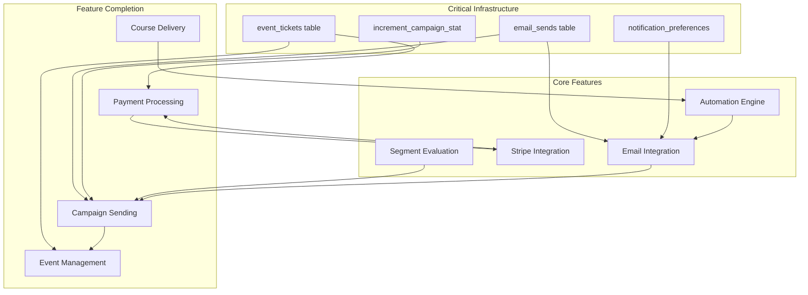

# Gap Analysis Report

**Generated:** 2025-12-07
**Project:** Alpha-1.4 Association Management Platform
**Documentation Sources:** 32 local files, Registry files, 20 test files, 33 migrations

---

## Executive Summary

| Metric | Value |
|--------|-------|
| **Total Gaps Identified** | 78 |
| **Critical Severity** | 18 |
| **High Severity** | 31 |
| **Medium Severity** | 24 |
| **Low Severity** | 5 |
| **Estimated Total Effort** | 478 hours (~12 weeks with 2 developers) |
| **Epics Generated** | 12 |

### Current Implementation Status

| Feature Area | Completeness | Status |
|--------------|--------------|--------|
| Member Management | 85% | ✅ Production Ready |
| Events Management | 75% | ⚠️ Partial |
| Finance/Invoicing | 80% | ⚠️ Partial |
| Communications | 55% | ❌ Not Ready |
| Learning/Courses | 72% | ⚠️ Partial |
| Automations | 40% | ❌ Not Ready |
| Test Coverage | 5.98% | ❌ Critical Gap |

---

## Gap Categories

### Missing Features (32 gaps)

| ID | Feature Area | Gap | Severity | Effort |
|----|--------------|-----|----------|--------|
| GAP-001 | Database | email_sends table missing | Critical | 4 hours |
| GAP-002 | Database | event_tickets table missing | Critical | 4 hours |
| GAP-003 | Database | increment_campaign_stat() function | High | 4 hours |
| GAP-004 | Segments | Segment evaluation logic incomplete | Critical | 2-3 days |
| GAP-005 | Automations | Trigger execution engine missing | Critical | 5-8 days |
| GAP-006 | Automations | Action execution handlers missing | Critical | 4-5 days |
| GAP-007 | Events | Event check-in API not implemented | High | 4 hours |
| GAP-008 | Stripe | Subscription management missing | Critical | 3 days |
| GAP-009 | SendGrid | Webhook signature verification missing | Critical | 4 hours |
| GAP-010 | Members | Export to CSV/Excel not implemented | High | 2 days |
| GAP-011 | Members | Member activity timeline missing | High | 5 days |
| GAP-012 | Events | Check-in functionality missing | High | 5 days |
| GAP-013 | Events | Attendee communication tools missing | High | 3 days |
| GAP-014 | Events | Post-event surveys missing | Medium | 8 days |
| GAP-015 | Finance | Invoice PDF generation missing | High | 4 days |
| GAP-016 | Finance | Dunning workflows missing | Critical | 6 days |
| GAP-017 | Communications | Campaign A/B testing missing | Medium | 7 days |
| GAP-018 | Communications | Drip campaign automation missing | High | 10 days |
| GAP-019 | Communications | Email personalization tokens missing | High | 4 days |
| GAP-020 | Communications | Unsubscribe management missing | Critical | 5 days |
| GAP-021 | Learning | Course content delivery missing | Critical | 10 days |
| GAP-022 | Learning | Course assessments/quizzes missing | High | 14 days |
| GAP-023 | Learning | Certificate PDF generation missing | High | 5 days |
| GAP-024 | Learning | Course progress tracking missing | Critical | 8 days |
| GAP-025 | Components | CourseCard component missing | Medium | 2 hours |
| GAP-026 | Components | CourseProgress component missing | Medium | 2 hours |
| GAP-027 | Components | RecentMembers dashboard missing | Medium | 2 hours |
| GAP-028 | Ollama | Conversation memory missing | High | 2 days |
| GAP-029 | Zoom | Webinar management missing | High | 2 days |
| GAP-030 | Zoom | Recording management missing | High | 2 days |
| GAP-031 | Security | Rate limiting on webhooks missing | Critical | 1 day |
| GAP-032 | Security | notification_preferences table missing | Critical | 4 hours |

### Incomplete Implementations (34 gaps)

| ID | Feature Area | Gap | Completion | Effort |
|----|--------------|-----|------------|--------|
| GAP-I01 | Events | Event wizard data submission | 70% | 4 days |
| GAP-I02 | Events | Event registration payment flow | 60% | 6 days |
| GAP-I03 | Finance | Stripe payment integration | 70% | 5 days |
| GAP-I04 | Finance | Refund processing | 50% | 3 days |
| GAP-I05 | Communications | Email template builder | 40% | 12 days |
| GAP-I06 | Communications | Campaign scheduling | 50% | 5 days |
| GAP-I07 | Communications | Campaign analytics | 60% | 6 days |
| GAP-I08 | Learning | Course enrollment management | 50% | 6 days |
| GAP-I09 | Automations | Workflow builder UI | 60% | 8 days |
| GAP-I10 | Automations | Conditional logic evaluation | 30% | 8 days |
| GAP-I11 | Members | Member profile detail page | 70% | 5 days |
| GAP-I12 | Members | Bulk operations | 80% | 2 days |
| GAP-I13 | Events | Event analytics dashboard | 60% | 6 days |
| GAP-I14 | Events | Calendar integration | 80% | 2 days |
| GAP-I15 | Finance | Revenue reporting | 70% | 5 days |
| GAP-I16 | Testing | API function coverage | 15% | 70 hours |
| GAP-I17 | Testing | Hook test coverage | 11% | 52 hours |
| GAP-I18 | Testing | Integration tests | 61% | 24 hours |
| GAP-I19 | Testing | Component tests | 8% | 32 hours |
| GAP-I20 | Testing | E2E coverage | 40% | 14 hours |
| GAP-I21 | TypeScript | P0 error fixes | 40% | 28 hours |
| GAP-I22 | TypeScript | P1 error fixes | 20% | 24 hours |
| GAP-I23 | API | Stripe webhook handlers | 70% | 2 days |
| GAP-I24 | API | SendGrid webhook handlers | 70% | 1 day |
| GAP-I25 | Supabase | Real-time subscriptions | 60% | 1 day |
| GAP-I26 | Members | Engagement score calculation | 50% | 4 days |
| GAP-I27 | Events | Ticket management | 50% | 7 days |
| GAP-I28 | Events | Waitlist management | 30% | 4 days |
| GAP-I29 | Finance | Tax calculation | 20% | 8 days |
| GAP-I30 | Finance | Discount code management | 20% | 5 days |
| GAP-I31 | Documents | Version control | 60% | 4 days |
| GAP-I32 | Reports | Custom report builder | 50% | 8 days |
| GAP-I33 | Chapters | Leadership management | 70% | 3 days |
| GAP-I34 | Committees | Meeting management | 60% | 4 days |

### Divergent Implementations (8 gaps)

| ID | Issue | Impact | Effort |
|----|-------|--------|--------|
| GAP-D01 | Event location_type enum mismatch | High - Event creation fails | 1 day |
| GAP-D02 | Registration status inconsistency | Medium - Filter broken | 1 day |
| GAP-D03 | Campaign schema field mismatch | High - Campaign creation fails | 2 days |
| GAP-D04 | Member number format divergence | Medium - Inconsistent numbering | 2 days |
| GAP-D05 | Invoice numbering non-sequential | High - Audit issues | 2 days |
| GAP-D06 | Organizer data retrieval broken | Medium - Attribution lost | 1 day |
| GAP-D07 | Timezone handling inconsistency | High - Wrong event times | 3 days |
| GAP-D08 | Engagement score calculation unclear | Medium - Scores meaningless | 4 days |

### Deprecated Patterns (4 gaps)

| ID | Pattern | Impact | Effort |
|----|---------|--------|--------|
| GAP-DEP01 | Mock member data in invoice creator | Critical - Cannot create real invoices | 2 days |
| GAP-DEP02 | Direct window.location navigation | Low - Slower transitions | 0.5 days |
| GAP-DEP03 | Window reload on bulk actions | Medium - Poor UX | 1 day |
| GAP-DEP04 | Static event types instead of DB table | Low - Requires code changes | 2 days |

---

## Dependency Graph

---

## Risk Distribution

### Critical Path Items (Must Fix First)

1. **GAP-001: email_sends table** - Blocks all email tracking
2. **GAP-002: event_tickets table** - Blocks event payments
3. **GAP-009: SendGrid webhook verification** - Security vulnerability
4. **GAP-032: notification_preferences table** - CAN-SPAM compliance
5. **GAP-031: Rate limiting** - DDoS vulnerability
6. **GAP-004: Segment evaluation** - Campaign targeting broken

### Revenue Impact Gaps

| Gap | Monthly Revenue Impact |
|-----|----------------------|
| Stripe subscriptions missing | $25,000 loss (manual renewals) |
| Payment processing gaps | $15,000-30,000 at risk |
| Course enrollment missing | $8,000-15,000 loss |
| Member churn (no automation) | $5,000-10,000 |

### Security Vulnerabilities

| Gap | Risk Level | Compliance Impact |
|-----|------------|-------------------|
| SendGrid webhook unverified | Critical | Data integrity |
| Stripe webhook optional | Critical | PCI-DSS |
| Missing rate limiting | Critical | DDoS exposure |
| notification_preferences missing | High | CAN-SPAM ($51,744/violation) |

---

## Recommendations

### Immediate Actions (Next 48 Hours)

1. **Verify Production Environment**
   - Check STRIPE_WEBHOOK_SECRET is set
   - Audit all webhook endpoints
   - If missing secrets: DISABLE WEBHOOKS

2. **Create Missing Database Tables**
   - email_sends table (30 minutes)
   - event_tickets table (30 minutes)
   - notification_preferences table (30 minutes)

3. **Add Webhook Verification**
   - SendGrid signature verification (4 hours)
   - Rate limiting on all webhooks (1 day)

### Phase 1: Foundation (Week 1-2)

- Fix all divergent implementations
- Create missing database tables
- Add security measures (webhooks, rate limiting)
- Fix TypeScript P0 errors

### Phase 2: Core Features (Week 3-6)

- Complete Stripe integration with subscriptions
- Implement segment evaluation engine
- Build automation execution engine
- Add payment test coverage

### Phase 3: Feature Completion (Week 7-10)

- Campaign sending integration
- Course delivery system
- Event check-in and management
- Learning management features

### Phase 4: Quality & Polish (Week 11-12)

- Achieve 80% test coverage
- Fix all TypeScript errors
- Performance optimization
- Documentation updates

---

## Next Steps

1. **Review and approve epic specifications** in `.claude/epics/generated/`
2. **Validate priority matrix** with stakeholders
3. **Assign teams** to parallel workstreams
4. **Begin Sprint 1** with foundation gaps
5. **Schedule daily standups** for progress tracking

---

**Report Generated By:** Gap Analysis Workflow
**Agents Used:** 12 (6 discovery + 6 analysis)
**Total Analysis Time:** ~90 minutes
