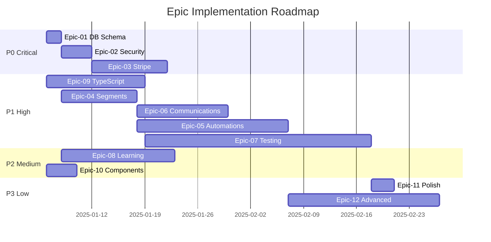

# Epic Priority Matrix

**Generated:** 2025-12-07
**Total Epics:** 12
**Total Effort:** 478 hours (~12 weeks with 2 developers)

---

## Effort vs. Business Value Matrix

```
                    HIGH VALUE
                        │
    ┌───────────────────┼───────────────────┐
    │                   │                   │
    │   QUICK WINS      │   STRATEGIC       │
    │                   │   INITIATIVES     │
    │  Epic-01: DB      │  Epic-03: Stripe  │
    │  Epic-02: Webhook │  Epic-04: Segment │
    │  Epic-09: Types   │  Epic-05: Auto    │
    │                   │  Epic-06: Comms   │
    │                   │  Epic-07: Testing │
LOW ├───────────────────┼───────────────────┤ HIGH
EFFORT                  │                   EFFORT
    │                   │                   │
    │   FILL-INS        │   TIME SINKS      │
    │                   │   (DEFER)         │
    │  Epic-10: Comps   │  Epic-08: Learn   │
    │  Epic-11: Polish  │  Epic-12: Advanced│
    │                   │                   │
    │                   │                   │
    └───────────────────┼───────────────────┘
                        │
                    LOW VALUE
```

---

## Priority Tiers

### P0: Critical Path (3 epics) - MUST COMPLETE FIRST

| Epic | Title | Effort | Value | Blocks |
|------|-------|--------|-------|--------|
| **Epic-01** | Database Schema Completion | 8 hours | Critical | 5+ epics |
| **Epic-02** | Security & Webhook Hardening | 16 hours | Critical | Production deployment |
| **Epic-03** | Stripe Payment Integration | 40 hours | Critical | Revenue collection |

**Total P0 Effort:** 64 hours (1.6 weeks)

### P1: High Priority (5 epics) - CORE FUNCTIONALITY

| Epic | Title | Effort | Value | Dependencies |
|------|-------|--------|-------|--------------|
| **Epic-04** | Segment Evaluation Engine | 40 hours | High | Epic-01 |
| **Epic-05** | Automation Execution Engine | 80 hours | High | Epic-01, Epic-04 |
| **Epic-06** | Communications Integration | 48 hours | High | Epic-01, Epic-04 |
| **Epic-07** | Test Coverage Foundation | 120 hours | High | Epic-09 |
| **Epic-09** | TypeScript Error Resolution | 52 hours | High | None |

**Total P1 Effort:** 340 hours (8.5 weeks)

### P2: Medium Priority (2 epics) - FEATURE COMPLETION

| Epic | Title | Effort | Value | Dependencies |
|------|-------|--------|-------|--------------|
| **Epic-08** | Learning Management System | 60 hours | Medium | Epic-01 |
| **Epic-10** | Component Completion | 16 hours | Medium | None |

**Total P2 Effort:** 76 hours (1.9 weeks)

### P3: Low Priority (2 epics) - ENHANCEMENTS

| Epic | Title | Effort | Value | Dependencies |
|------|-------|--------|-------|--------------|
| **Epic-11** | Code Quality & Polish | 12 hours | Low | Epic-07, Epic-09 |
| **Epic-12** | Advanced Features | 80+ hours | Low | All core epics |

**Total P3 Effort:** 92+ hours (2.3+ weeks)

---

## Implementation Sequence



---

## Parallel Workstreams

### Stream A: Infrastructure & Security (2 engineers)
- Week 1-2: Epic-01, Epic-02
- Week 3-4: Epic-03

### Stream B: Type Safety & Testing (1-2 engineers)
- Week 1-3: Epic-09
- Week 4-10: Epic-07

### Stream C: Feature Development (2-3 engineers)
- Week 2-4: Epic-04
- Week 4-6: Epic-06
- Week 5-10: Epic-05
- Week 3-6: Epic-08

### Stream D: UI/UX (1 engineer)
- Week 1-2: Epic-10
- Week 10-11: Epic-11

---

## Quick Wins (High Impact, Low Effort)

| Item | Epic | Effort | Impact |
|------|------|--------|--------|
| Create email_sends table | Epic-01 | 30 min | Unblocks email tracking |
| Create event_tickets table | Epic-01 | 30 min | Unblocks event payments |
| Add SendGrid verification | Epic-02 | 4 hours | Fixes security vulnerability |
| Create notification_preferences | Epic-01 | 30 min | CAN-SPAM compliance |
| Add CourseCard component | Epic-10 | 2 hours | Fixes learning dashboard |
| Add RecentMembers component | Epic-10 | 2 hours | Fixes main dashboard |
| Fix TypeScript export conflicts | Epic-09 | 3 hours | Unblocks 4 errors |

---

## Risk Mitigation

### High-Risk Epics

| Epic | Risk | Mitigation |
|------|------|------------|
| Epic-05 (Automations) | Scope creep, complexity | Dedicated architect, strict scope |
| Epic-07 (Testing) | Time underestimation | Incremental coverage targets |
| Epic-03 (Stripe) | External API changes | Version pinning, extensive tests |

### Dependencies to Monitor

| Dependency | Impact if Delayed | Contingency |
|------------|-------------------|-------------|
| Epic-01 → Epic-04,05,06 | Blocks 3 epics | Prioritize above all else |
| Epic-04 → Epic-06 | Campaigns won't target | Manual targeting workaround |
| Epic-09 → Epic-07 | Tests may fail on types | Fix critical types first |

---

## Resource Allocation

### Recommended Team Structure

| Role | Epic Assignments | Weeks |
|------|-----------------|-------|
| **Backend Lead** | Epic-03, Epic-05 | 1-10 |
| **Backend Dev 1** | Epic-01, Epic-02, Epic-04 | 1-4 |
| **Backend Dev 2** | Epic-06, Epic-08 | 4-8 |
| **Frontend Dev** | Epic-10, Epic-11 | 1-2, 10-11 |
| **QA Engineer** | Epic-07 | 4-12 |
| **DevOps** | Epic-02 (partial) | 1-2 |

### Sprint Velocity Assumptions

- 2 developers: 40 hours/week each
- 80 hours/sprint (2-week sprints)
- 20% buffer for meetings, reviews, bugs

---

## Success Metrics

### Sprint 1 (Weeks 1-2)
- [ ] 0 P0 database gaps
- [ ] All webhook endpoints secured
- [ ] TypeScript P0 errors < 20

### Sprint 2 (Weeks 3-4)
- [ ] Stripe integration complete
- [ ] Segment evaluation working
- [ ] Test coverage > 30%

### Sprint 3 (Weeks 5-6)
- [ ] Campaign sending functional
- [ ] Automation triggers working
- [ ] Test coverage > 50%

### Sprint 4 (Weeks 7-8)
- [ ] Automation actions complete
- [ ] Learning module functional
- [ ] Test coverage > 65%

### Sprint 5 (Weeks 9-10)
- [ ] All P1 epics complete
- [ ] Test coverage > 75%
- [ ] 0 TypeScript errors

### Sprint 6 (Weeks 11-12)
- [ ] Test coverage > 80%
- [ ] All components complete
- [ ] Production deployment ready

---

## Budget Summary

| Category | Hours | Cost (@$150/hr) |
|----------|-------|-----------------|
| P0 Critical | 64 | $9,600 |
| P1 High | 340 | $51,000 |
| P2 Medium | 76 | $11,400 |
| P3 Low | 92 | $13,800 |
| **Total** | **572** | **$85,800** |

*Note: Includes 20% buffer on base 478 hours*

---

**Approved By:** _________________
**Date:** _________________
**Sprint 1 Start Date:** _________________
