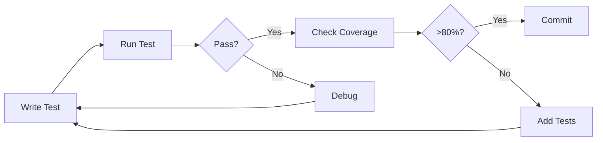

# Component Testing Quick Start Guide

**Date:** 2025-11-29
**Phase:** PLAN → CODE Handoff
**Next Agent:** tester

---

## Quick Start (5 Minutes)

### 1. Install Dependencies

```bash
npm install -D @testing-library/react @testing-library/jest-dom @testing-library/user-event \
  vitest @vitest/ui jsdom @vitejs/plugin-react msw vitest-canvas-mock @axe-core/react
```

### 2. Create Config Files

**vitest.config.ts** (see full config in testing-strategy.md)

**tests/setup.ts** (see full setup in testing-strategy.md)

### 3. Add NPM Scripts

```json
{
  "scripts": {
    "test": "vitest",
    "test:ui": "vitest --ui",
    "test:coverage": "vitest --coverage"
  }
}
```

### 4. Run Your First Test

Create `tests/__tests__/components/ui/button.test.tsx`:

```typescript
import { describe, it, expect } from 'vitest'
import { render, screen } from '@testing-library/react'
import { Button } from '@/components/ui/button'

describe('Button', () => {
  it('renders correctly', () => {
    render(<Button>Click me</Button>)
    expect(screen.getByRole('button', { name: 'Click me' })).toBeInTheDocument()
  })
})
```

Run: `npm test`

---

## Priority 1: Critical Tests (Start Here)

### Week 1-2: Essential Tests

1. **Login Flow** (8 tests)
   - File: `tests/__tests__/app/auth/login.test.tsx`
   - Template: `tests/templates/form-component.test.tsx`
   - Focus: Email/password validation, OAuth, error states

2. **Stripe Checkout** (6 tests)
   - File: `tests/__tests__/actions/stripe.test.ts`
   - Mock: `tests/mocks/stripe.ts`
   - Focus: Payment creation, session handling, errors

3. **Invoice Creation** (6 tests)
   - File: `tests/__tests__/app/finance/invoices/create.test.tsx`
   - Focus: Form validation, Supabase mutations, calculations

4. **Member Import** (5 tests)
   - Focus: CSV parsing, bulk operations, error handling

5. **Password Reset** (4 tests)
   - Focus: Email validation, token handling, success flow

**Total P1: 45 tests**

---

## Testing Patterns Cheat Sheet

### Pattern 1: Basic Component Test

```typescript
import { render, screen } from '@testing-library/react'
import { ComponentName } from '@/components/...'

it('renders correctly', () => {
  render(<ComponentName>Content</ComponentName>)
  expect(screen.getByText('Content')).toBeInTheDocument()
})
```

### Pattern 2: User Interaction

```typescript
import userEvent from '@testing-library/user-event'

it('handles click', async () => {
  const user = userEvent.setup()
  const handleClick = vi.fn()

  render(<Button onClick={handleClick}>Click</Button>)
  await user.click(screen.getByRole('button'))

  expect(handleClick).toHaveBeenCalledTimes(1)
})
```

### Pattern 3: Form Validation

```typescript
import { waitFor } from '@testing-library/react'

it('validates email', async () => {
  const user = userEvent.setup()
  render(<LoginForm />)

  await user.type(screen.getByPlaceholderText('Email'), 'invalid')
  await user.click(screen.getByRole('button', { name: /submit/i }))

  await waitFor(() => {
    expect(screen.getByText('Invalid email')).toBeInTheDocument()
  })
})
```

### Pattern 4: Async Data

```typescript
import { waitFor } from '@testing-library/react'
import { renderWithProviders } from '@/tests/utils/render-with-providers'

it('loads data', async () => {
  mockSupabaseClient.from.mockReturnValue({
    select: vi.fn().mockResolvedValue({
      data: [{ id: 1, name: 'Test' }],
      error: null
    })
  })

  renderWithProviders(<MembersList />)

  await waitFor(() => {
    expect(screen.getByText('Test')).toBeInTheDocument()
  })
})
```

### Pattern 5: Accessibility

```typescript
import { axe, toHaveNoViolations } from 'jest-axe'
expect.extend(toHaveNoViolations)

it('has no a11y violations', async () => {
  const { container } = render(<Component />)
  const results = await axe(container)
  expect(results).toHaveNoViolations()
})
```

---

## Common Mocks

### Supabase Client

```typescript
import { mockSupabaseClient } from '@/tests/mocks/supabase'

// Mock query
mockSupabaseClient.from.mockReturnValue({
  select: vi.fn().mockResolvedValue({ data: [...], error: null })
})

// Mock auth
mockSupabaseClient.auth.signInWithPassword.mockResolvedValue({
  data: { session: mockSession },
  error: null
})
```

### Next.js Router

```typescript
import { mockRouter } from '@/tests/mocks/next-router'

// Verify navigation
expect(mockRouter.push).toHaveBeenCalledWith('/dashboard')
```

### Server Actions

```typescript
import { createInvoiceCheckoutSession } from '@/app/actions/stripe'

vi.mocked(createInvoiceCheckoutSession).mockResolvedValue('cs_test_123')
```

---

## File Structure Template

```
tests/
├── setup.ts                                    # ✅ Create first
├── mocks/
│   ├── supabase.ts                             # ✅ Create first
│   ├── next-router.ts                          # ✅ Create first
│   ├── stripe.ts                               # P1: Stripe tests
│   └── server-actions.ts                       # P1: Server action tests
├── utils/
│   ├── render-with-providers.tsx               # ✅ Create first
│   └── test-data.ts                            # P1: Mock data
└── __tests__/
    ├── app/
    │   └── auth/
    │       └── login.test.tsx                  # 🎯 START HERE (P1)
    ├── actions/
    │   └── stripe.test.ts                      # 🎯 P1
    └── components/
        └── ui/
            └── button.test.tsx                 # 🎯 P1 (simple starter)
```

---

## Testing Checklist

### Before Writing Tests
- [ ] Vitest config created
- [ ] Test setup file created
- [ ] Supabase mock created
- [ ] Router mock created
- [ ] Custom render utility created

### For Each Component
- [ ] Happy path test (renders correctly)
- [ ] User interaction test (clicks, typing)
- [ ] Error state test
- [ ] Loading state test (if async)
- [ ] Accessibility test (keyboard, ARIA)
- [ ] Edge case test (empty, null, invalid)

### Before Committing
- [ ] All tests pass: `npm test`
- [ ] Coverage meets target: `npm test -- --coverage`
- [ ] No console errors/warnings
- [ ] Tests are isolated (no interdependencies)
- [ ] Mock cleanup in afterEach hooks

---

## Troubleshooting

### "Cannot find module '@/components/...'"

**Fix:** Check `vitest.config.ts` alias configuration matches `tsconfig.json`

### "window is not defined"

**Fix:** Ensure `environment: 'jsdom'` in `vitest.config.ts`

### "useRouter is not a function"

**Fix:** Import router mock in `tests/setup.ts`

### Flaky Tests (Random Failures)

**Fix:** Use `waitFor` instead of arbitrary timeouts, ensure proper cleanup

### "ResizeObserver is not defined"

**Fix:** Mock in `tests/setup.ts` (already included in template)

---

## Testing Workflow



---

## Coverage Targets

| Component Type | Target Coverage |
|----------------|----------------|
| Auth (P1) | 95%+ |
| Payments (P1) | 95%+ |
| Forms (P2) | 85%+ |
| UI Components (P3) | 80%+ |
| **Overall** | **85%+** |

---

## Next Steps for tester Agent

### Immediate Actions (Day 1)

1. **Setup Infrastructure**
   ```bash
   npm install -D [dependencies]
   # Create vitest.config.ts
   # Create tests/setup.ts
   # Create tests/mocks/supabase.ts
   # Create tests/utils/render-with-providers.tsx
   ```

2. **Verify Setup**
   ```bash
   npm test  # Should run with no tests (pass)
   ```

3. **First Test (Button)**
   - Create `tests/__tests__/components/ui/button.test.tsx`
   - Copy template from testing-strategy.md
   - Run: `npm test button`
   - Verify: Test passes

### Week 1 Goals

- [ ] Complete testing infrastructure setup
- [ ] Write 10 tests for Login flow
- [ ] Write 6 tests for Stripe checkout
- [ ] Write 5 tests for Button component
- [ ] Achieve 95%+ coverage on auth flows

### Week 2 Goals

- [ ] Complete all Priority 1 tests (45 total)
- [ ] Set up CI/CD integration
- [ ] Document any testing pattern discoveries
- [ ] Handoff to accessibility-expert for a11y suite

---

## Resources

- **Full Strategy:** `.claude/testing-strategy.md`
- **Testing Library Docs:** https://testing-library.com/react
- **Vitest Docs:** https://vitest.dev
- **Axe Accessibility:** https://www.deque.com/axe/

---

**Ready to Start?** Run: `npm install -D [dependencies]` then create `vitest.config.ts`

**Questions?** Check `.claude/testing-strategy.md` Section 4 (Testing Patterns)

**Stuck?** See Troubleshooting section above or consult debugger agent
